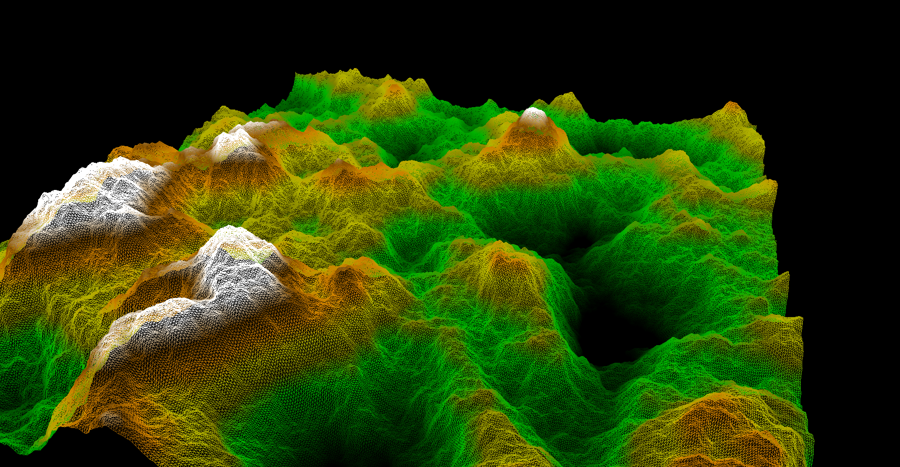
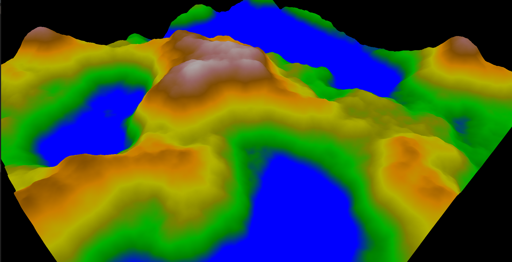

# NoiseMapGL

NoiseMapGL is a project that generates and visualizes Perlin 2D Noise Maps using OpenGL. The project is written in C++.

## Features

- Real-time noise map generation
- Interactive controls for navigation and regeneration

## Controls

- **W**: Move forward
- **A**: Move left
- **S**: Move backward
- **D**: Move right
- **Space**: Regenerate the noise map

## Installation

1. Clone the repository:
    ```sh
    git clone https://github.com/abksm/NoiseMapGL.git
    ```
2. Navigate to the project directory:
    ```sh
    cd NoiseMapGL
    ```
3. Build the project using your preferred method (e.g., using CMake).

## Usage

Run the executable generated after building the project. Use the controls mentioned above to interact with the noise map.

## Images

Here are some images showcasing the noise maps generated by the project:



